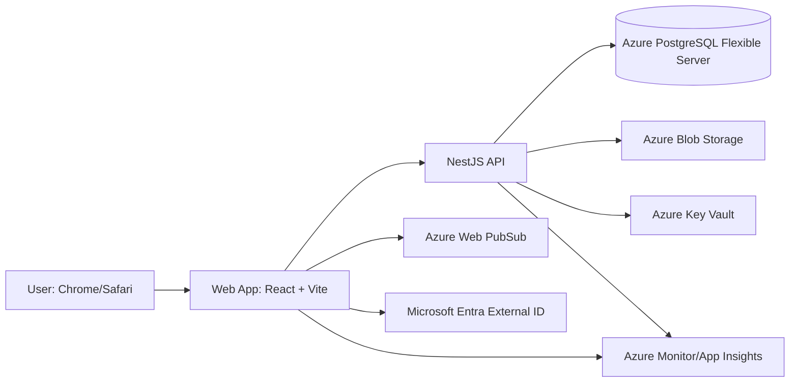

# ARCHITECTURE: NoteLabs (노트랩) 웹앱 (MVP)

## 1. 문서 목적
이 문서는 PRD 요구사항을 만족하기 위한 기술 스택, 시스템 구조, 운영 전략을 정의한다.
MVP 기준으로 빠른 출시와 안정적 확장을 동시에 고려한다.

## 2. 아키텍처 목표
1. 필기 성능: 펜 입력 지연 p95 <= 30ms
2. 안정성: 자동 저장 실패율 < 0.5%
3. 동기화: 멀티 디바이스 반영 p95 <= 5초
4. 호환성: Chrome 우선 + Safari 핵심 기능 보장
5. 확장성: Post-MVP에서 PDF 편집, OCR, 협업으로 확장 가능

## 3. 권장 기술 스택 요약

| 레이어 | 권장 스택 | 선택 이유 |
|---|---|---|
| Frontend App | React + TypeScript + Vite | 빠른 개발 생산성, 풍부한 생태계, 성능 최적화 용이 |
| UI | Tailwind CSS + Radix UI | 빠른 UI 구축, 접근성 기반 컴포넌트 |
| 상태관리 | Zustand + TanStack Query | 캔버스 로컬 상태와 서버 상태 분리 관리 |
| 캔버스 엔진 | HTML5 Canvas 2D + Pointer Events + perfect-freehand | 필기 성능/압력값 대응, 라이브러리 의존 최소화 |
| 백엔드 API | NestJS (Node.js, TypeScript) | 구조화된 서버, 인증/도메인 분리 쉬움 |
| 인증 | Microsoft Entra External ID (고객용) | Azure 네이티브 인증/보안 정책 연계 |
| DB | Azure Database for PostgreSQL - Flexible Server | 관계형 데이터 모델과 운영 안정성 |
| 실시간/동기화 | Azure Web PubSub(또는 Azure SignalR) + 서버 버전 관리 | 멀티 디바이스 동기화 알림/반영 |
| 파일 저장소 | Azure Blob Storage | 내보내기 파일 및 스냅샷 저장 |
| PDF 생성 | pdf-lib (+ 서버 변환 유틸) | 캔버스 결과를 PDF로 안정 출력 |
| i18n | i18next + react-i18next | 한국어/영어 전환 용이 |
| 테스트 | Vitest + Playwright + k6 | 단위/브라우저/E2E/성능 테스트 분리 |
| 배포 | Azure Static Web Apps(FE) + Azure Container Apps(BE) | Azure 통합 운영/스케일링 |
| 모니터링 | Azure Monitor + Application Insights + Log Analytics | Azure 네이티브 관측성 |
| 비밀 관리 | Azure Key Vault + Managed Identity | 시크릿 하드코딩 방지, 최소 권한 인증 |

## 4. 시스템 구조

## 5. 프론트엔드 아키텍처

### 5.1 코어 프레임워크
- React + TypeScript + Vite
- 라우팅: React Router
- 폴더 구조(권장)
  - src/app
  - src/features/auth
  - src/features/notes
  - src/features/editor
  - src/features/settings
  - src/shared/ui
  - src/shared/lib

### 5.2 캔버스 설계
- 렌더링: Canvas 2D 컨텍스트
- 입력: Pointer Events (pointerdown/move/up)
- 필기 품질
  - 좌표 샘플링 + 선 안정화
  - pressure 값 지원(가능한 기기)
  - 툴별 브러시 엔진 분리(펜/형광펜/지우개)
- 편집 기능
  - Undo/Redo: 커맨드 스택
  - 올가미: 경로 기반 hit-test
  - 도형 보정: stroke 후처리(직선/원/사각형)

### 5.3 상태관리 전략
- Zustand: 에디터 로컬 상태(현재 도구, 선택, 히스토리)
- TanStack Query: 서버 상태(노트 목록, 페이지 메타데이터)
- 자동 저장 큐
  - 디바운스(예: 800ms)
  - 실패 시 재시도 지수 백오프
  - UI 저장 상태 표시

### 5.4 브라우저 대응
- Chrome: 기준 브라우저
- Safari: Pointer Events/Canvas 차이 대응 분기
- 폴리필 최소화, 기능 감지 기반 분기 적용

### 5.5 초기 화면 정책 (MVP)
- 메인 캔버스 중심 편집: 필기/텍스트/PDF 주석은 중앙 캔버스에서 수행
- 우측 상단 햄버거 메뉴: 라이브러리 패널 토글 진입점
- 라이브러리 패널:
  - 노트 전환(목록에서 즉시 편집 노트 전환)
  - 최근/고정/검색 결과 기반 빠른 열기
- 디바이스별 패널 형태:
  - 모바일/태블릿: 오버레이
  - 노트북/데스크톱: 사이드 패널

## 6. 백엔드 아키텍처

### 6.1 API 계층
- NestJS 모듈
  - AuthModule
  - NotesModule
  - PagesModule
  - StrokesModule
  - SyncModule
  - ExportModule
- 런타임 배포 대상
  - Azure Container Apps (권장)
  - 대안: Azure App Service (Linux)

### 6.2 API 스타일
- REST 우선
  - /auth/*
  - /notes/*
  - /pages/*
  - /strokes/*
  - /sync/*
  - /export/pdf
- 실시간 이벤트
  - 노트 업데이트 알림 채널
- 인증 토큰 검증
  - Entra External ID JWT 검증

### 6.3 동기화/충돌 정책
- 엔터티 버전 필드(version) 유지
- 저장 시 조건부 업데이트(compare-and-set)
- 버전 충돌 시
  1. 원본 유지
  2. 충돌 사본(conflict copy) 생성
  3. 사용자에게 복구 가능한 상태 제공
  4. Web PubSub 채널로 갱신 이벤트 전달

### 6.4 Sync API 계약 (MVP)
- Endpoint: `POST /api/notebooks/{id}/sync`
- Header: `Idempotency-Key: {notebook_id}-{client_seq}`
- 기본 정책:
  - ACK 미수신 시 지수 백오프 재시도(1s, 2s, 4s, 8s, 16s)
  - 중복 요청은 Idempotency-Key 기반 중복 반영 방지
- 충돌 응답 최소 필드:
  - `status: conflict`
  - `serverVersion`
  - `conflictRegions`
  - `mergeCandidates`

## 7. 데이터 저장 구조

### 7.1 엔터티
- users
- notes
- pages
- strokes
- sync_versions
- exports
- integrations (선택: auth subject 매핑)

### 7.2 권장 스키마 필드(핵심)
- notes
  - id, user_id, title, created_at, updated_at, version
- pages
  - id, note_id, page_order, created_at, updated_at, version
- strokes
  - id, page_id, tool_type, color, width, points_json, created_at, updated_at, version

### 7.3 인덱스 전략
- notes(user_id, updated_at desc)
- pages(note_id, page_order)
- strokes(page_id, updated_at)

## 8. PDF 내보내기 전략
- 1차(MVP): 캔버스 렌더 결과를 페이지 단위 이미지로 변환 후 PDF 합성
- 구현 옵션
  1. 클라이언트 생성: 빠르지만 브라우저 의존
  2. 서버 생성: 결과 일관성 높음 (권장)
- 권장: 서버 생성 우선, 실패 시 클라이언트 fallback

## 9. 오프라인/저장 전략 (부분 지원 기준)
- IndexedDB 사용
  - 임시 스트로크/페이지 로컬 캐시
  - 네트워크 복구 시 업로드 큐 재전송
- 충돌 시 사본 생성 정책 유지
- 오프라인 범위 권장안
  - 열람 + 편집 + 임시저장 가능
  - 로그인/동기화/내보내기는 온라인 필요
- Azure 연계
  - 온라인 복귀 시 API를 통해 서버 반영 후 Web PubSub 이벤트로 타 디바이스 갱신

### 9.1 복구 정책 수치 (MVP 기준)
- 자동 스냅샷: 5분 또는 20회 변경마다 생성(선도달 조건)
- 휴지통 보관: 30일
- 복구 목표:
  - RTO: 복원 요청 후 10분 이내
  - RPO: 최대 5분

## 10. 보안 아키텍처
1. HTTPS 전용
2. Entra External ID 기반 인증/JWT 검증
3. 사용자 소유권 검증(리소스 접근 제어)
4. JWT 만료/갱신 정책 적용
5. 요청 레이트 리밋(로그인, 내보내기 엔드포인트)
6. Key Vault 기반 비밀 관리
7. 백엔드에서 Azure 리소스 접근 시 Managed Identity 우선

## 11. 관측성(Observability)
- 프론트
  - Application Insights Web SDK: 런타임 에러, 성능 이벤트
  - Web Vitals 수집
- 백엔드
  - OpenTelemetry + Azure Monitor: API latency, error rate, DB query time
  - 구조화 로그(JSON)
- 알람
  - autosave_failed 급증
  - sync_conflict 급증
  - export_pdf_failed 급증

## 12. 테스트 전략

### 12.1 단위 테스트
- 브러시 연산, 도형 보정, 히스토리 스택

### 12.2 통합 테스트
- 저장/동기화/충돌 사본 생성

### 12.3 E2E 테스트
- Playwright
  - 로그인 -> 노트 생성 -> 필기 -> 자동저장 -> 재접속
  - Chrome/Safari 핵심 시나리오

### 12.4 성능 테스트
- k6 + 커스텀 벤치
  - 자동 저장 p95
  - 동기화 반영 p95
  - 에디터 인터랙션 FPS/지연 측정

### 12.5 OCR 품질 기준 (MVP)
- 한글 문자 정확도 >= 94%
- 영문 문자 정확도 >= 96%
- 숫자 인식 정확도 >= 98%
- 혼합 수식/필기 검색 성공률 >= 85%
- 측정 방식: 언어별 100샘플 수동 검수(월 1회)

## 13. 배포/운영 아키텍처

### 13.1 환경 분리
- dev
- staging
- production

### 13.2 CI/CD
- GitHub Actions
  1. lint + test
  2. build
  3. preview deploy
  4. staging 승인 후 prod 배포
  5. Azure 로그인은 OIDC(Federated Credential) 사용

### 13.3 권장 배포 방식
- 프론트: Azure Static Web Apps
- 백엔드: Azure Container Apps (또는 Azure App Service)
- DB: Azure Database for PostgreSQL - Flexible Server
- Auth: Microsoft Entra External ID
- Storage: Azure Blob Storage
- Realtime: Azure Web PubSub (또는 Azure SignalR)

## 14. 대안 스택 비교

| 옵션 | 장점 | 단점 | 권장도 |
|---|---|---|---|
| Azure PaaS 중심 (권장) | Azure 통합 운영, 보안/관측성 일원화 | 초기 서비스 학습 필요 | 높음 |
| Azure + 일부 타사(BaaS) 혼합 | 개발 속도 우수 | 운영/권한 모델 이원화 | 중간 |
| 완전 자체 구축 (AKS + Postgres + Redis) | 제어력 높음 | 초기 구축 비용 큼 | 낮음 (MVP 기준) |

## 15. MVP 착수 체크리스트
1. 캔버스 엔진 PoC로 p95 지연 측정
2. 동기화 충돌 사본 생성 API PoC
3. Chrome/Safari 입력 이벤트 차이 테스트
4. PDF 내보내기 서버 경로 검증
5. Azure Monitor/App Insights 기본 계측 적용
6. Entra External ID + API JWT 검증 PoC
7. Key Vault + Managed Identity 연결 검증

## 16. 결정 필요 항목
1. 오프라인 부분 지원 범위 최종 확정
2. Safari 우선순위(macOS 우선 vs iPadOS 동시)
3. PDF 열기/수정 기능의 MVP 포함 여부

---
본 문서는 PRD를 구현 가능한 기술 설계 관점으로 구체화한 아키텍처 초안이다.
