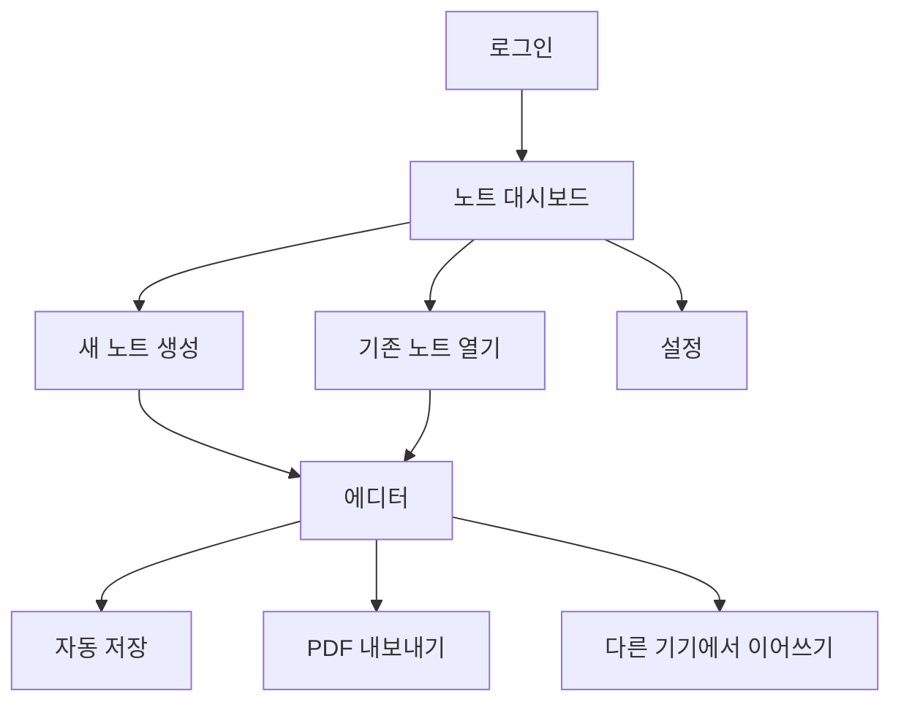

# IDEATION: NoteLabs (노트랩)

## 1. 프로젝트 목표
학생/직장인이 태블릿과 노트북에서 모두 사용할 수 있는 개인용 필기 웹앱을 만든다.
초기에는 "빈 페이지 자유 필기"를 핵심으로 제공하고, 이후 PDF 열기/수정 경험을 빠르게 추가한다.

## 2. 현재까지 확정된 방향
- 타깃 사용자: 학생 + 직장인
- 주 사용 기기: 태블릿 + 노트북
- 스타일러스 우선순위: 중요하지만 2순위
- 초기 최적화: Galaxy Tab + S Pen, 노트북(마우스/터치패드)
- 필기 품질 목표: 실사용 충분 수준
- 1차 중요 고급 기능: 되돌리기, 올가미 선택, 손글씨 품질 개선, 도형 자동보정, 멀티 디바이스 동기화
- 제품 방향: 빈 페이지 자유 필기 중심 + PDF 열기/수정 추가
- 동기화: 계정 기반 클라우드 동기화
- 클라우드/인프라 방향: Azure 기반으로 구축
- 협업: 1차 제외(개인 사용)
- 내보내기: PDF만
- 비즈니스 모델: 무료 시작
- 지원 언어: 한국어/영어
- 브라우저: Chrome 우선, Safari 지원
- 일정: 최대한 빠르게

## 3. 제품 원칙 (MVP)
- 필기 흐름을 끊지 않는다: 빠른 진입, 빠른 저장, 빠른 복귀
- 문서 구조를 단순하게 유지한다: 노트북 > 페이지
- 크로스 디바이스 일관성을 보장한다: 동일 계정이면 동일 노트 상태
- 기본 품질을 먼저 맞춘다: 지연/튐/저장 유실 최소화

## 4. 핵심 사용자 시나리오
1. 사용자가 로그인한다.
2. 새 노트를 생성한다.
3. 빈 페이지에서 펜/형광펜으로 필기하고, 지우개/올가미/되돌리기를 사용한다.
4. 도형을 빠르게 그리면 자동 보정된다.
5. 작성 내용이 자동 저장되고, 다른 기기에서 이어서 편집한다.
6. 노트를 PDF로 내보낸다.
7. (확장) PDF 파일을 열어 주석/수정 후 다시 저장한다.

## 5. 1차 MVP 기능 명세서

### 5.1 기능 목록 (Must/Should)
| 구분 | 기능 | 우선순위 | 설명 | 완료 기준 |
|---|---|---|---|---|
| 계정 | 이메일 로그인 | Must | 개인 데이터 식별 및 동기화 시작점 | 회원가입/로그인/로그아웃 가능 |
| 문서 | 노트 생성/삭제/이름변경 | Must | 개인 노트 관리 | 노트 목록에서 CRUD 동작 |
| 캔버스 | 자유 필기(펜/형광펜/지우개) | Must | 기본 필기 경험 | 선 그리기/지우기 지연이 실사용 가능 수준 |
| 편집 | 되돌리기/다시하기 | Must | 실수 복구 | 직전 편집 이력 정확 복원 |
| 편집 | 올가미 선택 | Must | 영역 선택 후 이동/복사 | 선택 오브젝트 이동/복제 가능 |
| 편집 | 도형 자동보정 | Must | 손그림 도형을 정형화 | 원/직선/사각형 기본 보정 |
| 품질 | 손글씨 품질 개선(안정화) | Must | 선 떨림 완화 | 선 안정화 옵션 적용 가능 |
| 저장 | 자동 저장 | Must | 데이터 유실 방지 | 편집 후 일정 시간 내 자동 반영 |
| 동기화 | 멀티 디바이스 동기화 | Must | 태블릿/노트북 연속 사용 | 다른 기기에서 최신 노트 확인 |
| 내보내기 | PDF export | Must | 공유/보관 기본 포맷 | 단일 노트를 PDF로 다운로드 |
| 다국어 | 한국어/영어 UI | Should | 초기 글로벌 대응 | 앱 언어 전환 가능 |
| 브라우저 | Chrome + Safari 지원 | Should | 목표 브라우저 호환 | 핵심 흐름 정상 동작 |
| PDF 편집 | PDF 열기/수정 | Should (초기 확장) | 자유 필기 다음 단계 기능 | PDF import 후 주석 저장 가능 |

### 5.2 범위 제외 (1차)
- 실시간 협업(공동 편집)
- PNG/JPG export
- 공유 링크
- 유료 플랜/결제
- 고급 OCR/텍스트 변환
- 오디오 녹음 연동

### 5.3 비기능 요구사항 (MVP 기준)
- 성능: 일반적인 노트 20페이지 기준, 페이지 전환 및 필기 반응이 체감 지연 없이 동작
- 안정성: 새로고침/브라우저 재접속 시 최근 저장 상태 복원
- 보안(기본선): HTTPS, 비밀번호 해시 저장, 사용자별 접근제어
- 호환성: Chrome 최신 2개 버전, Safari 최신 2개 버전 우선 검증

## 6. 화면 구상 (IA + 주요 컴포넌트)

### 6.1 화면 목록
1. 온보딩/로그인 화면
2. 노트 대시보드(노트 목록)
3. 에디터 화면(핵심)
4. 설정 화면(언어, 계정, 필기 옵션)

### 6.2 에디터 화면 구성
- 상단 바:
  - 노트 제목
  - 저장 상태(저장 중/저장됨)
  - 되돌리기/다시하기
  - 내보내기(PDF)
- 좌측 패널:
  - 페이지 썸네일 목록
  - 페이지 추가/삭제
- 중앙 캔버스:
  - 자유 필기 영역(줌/팬 포함)
- 하단/플로팅 툴바:
  - 펜, 형광펜, 지우개, 올가미, 도형 보정 토글
- 우측 보조 패널(초기 간소화 가능):
  - 색상/두께 프리셋

### 6.3 화면 플로우


### 6.4 에디터 와이어프레임(텍스트)
```text
+--------------------------------------------------------------------------------+
| [노트제목]    [저장됨]      [Undo] [Redo]                    [Export PDF]      |
+----------------------+---------------------------------------------------------+
| 페이지 썸네일        |                                                         |
| - p1                 |                    캔버스 영역                          |
| - p2                 |            (필기/올가미/도형 보정 동작)                |
| - + 페이지 추가      |                                                         |
|                      |                                                         |
+----------------------+---------------------------------------------------------+
| [펜] [형광펜] [지우개] [올가미] [도형보정] [색상] [굵기]                      |
+--------------------------------------------------------------------------------+
```

## 7. 개발 로드맵 (6주 제안)

### Week 1: 기반 구축
- 인증(회원가입/로그인/로그아웃) 기본 플로우
- 노트 데이터 모델 설계(노트, 페이지, 스트로크)
- 대시보드/에디터 기본 레이아웃
- 자동 저장 기본 구조(로컬 임시 + 서버 반영 큐)
- Azure 리소스 초기 세팅(환경 분리, 비밀 관리, 배포 파이프라인 초안)

### Week 2: 필기 코어
- 캔버스 렌더링 엔진 적용
- 펜/형광펜/지우개 구현
- 선 안정화(손글씨 품질 개선) 1차 적용
- Undo/Redo 히스토리 스택 구현

### Week 3: 편집 고급 기능
- 올가미 선택(선택/이동/복제)
- 도형 자동보정(직선/원/사각형)
- 페이지 썸네일 패널 + 페이지 관리
- 성능 측정(필기 지연/메모리)

### Week 4: 동기화 + 내보내기
- 계정 기반 클라우드 동기화
- 다중 기기 최신 상태 반영
- PDF 내보내기 구현
- 저장 충돌 시 충돌 사본 생성 정책 적용

### Week 5: 브라우저/언어 품질
- Chrome 안정화
- Safari 호환성 이슈 수정
- 한국어/영어 i18n 적용
- 오류 추적/로그/예외 처리 보강

### Week 6: 베타 하드닝
- E2E 시나리오 테스트(로그인->필기->동기화->내보내기)
- 성능 튜닝 및 회귀 테스트
- 릴리스 체크리스트 정리
- PDF 열기/수정(확장 기능) 스파이크 또는 1차 반영

## 8. 리스크와 대응
- 필기감 품질 리스크: 선 안정화 알고리즘 옵션화 및 기기별 튜닝값 분리
- Safari 렌더링 차이: Canvas/WebGL fallback 전략 준비
- 동기화 충돌 리스크: 충돌 사본 생성으로 데이터 유실 방지
- 데이터 모델 복잡도: 스트로크 단위 저장 + 버전 필드로 점진 확장

## 9. 다음 의사결정 (빠른 착수용)
1. 오프라인 부분 지원 범위 확정(열람 전용 vs 편집+임시저장)
2. Safari 지원 우선순위 확정(macOS만 우선인지 iPadOS 포함인지)
3. PDF 열기/수정 기능을 Week 6에 포함할지, 2차 릴리스로 분리할지

## 10. 교차검증 결과 (Gemini 3.1 Pro / ChatGPT 5 mini 관점)

### 10.1 수행 방식 및 한계
- 현재 작업 환경에서는 외부 상용 모델(Gemini 3.1 Pro, ChatGPT 5 mini) API를 직접 호출할 수 없다.
- 따라서 본 섹션은 두 모델이 일반적으로 강점을 보이는 검토 관점을 분리해 교차검증한 결과를 기록한다.
- 추후 실제 모델 응답 로그를 확보하면, 아래 결과와 차이를 비교해 업데이트한다.

### 10.2 Gemini 3.1 Pro 관점 검토 (제품/UX/시장성 중심)
- 강점 판단:
  - 타깃(학생/직장인)과 디바이스(태블릿/노트북) 정의가 명확하다.
  - 1차 범위에서 개인용 집중 전략(협업 제외)이 적절하다.
  - 핵심 경험(필기 -> 저장 -> 동기화 -> PDF 내보내기) 사용자 흐름이 일관적이다.
- 보완 제안:
  - 오프라인 "부분 지원"을 사용자 언어로 재정의해야 한다.
  - 예: "오프라인 편집 가능, 재접속 시 자동 동기화, 충돌 시 사본 생성"처럼 정책을 UI 문구로 명시.
  - Safari 지원 범위를 macOS/iPadOS로 분리해 단계적 출시 전략을 문서화해야 한다.
  - KPI 정의가 부족하다(예: 1일 잔존율, 주간 활성 사용자, 노트 생성/내보내기 전환율).

### 10.3 ChatGPT 5 mini 관점 검토 (구현/리스크/실행계획 중심)
- 강점 판단:
  - Must/Should 분리가 되어 있어 구현 우선순위가 분명하다.
  - 주차별 로드맵이 기술 순서(코어 -> 고급 -> 동기화 -> 하드닝)에 맞다.
  - 주요 리스크(필기감/Safari/동기화 충돌)가 사전에 식별되었다.
- 보완 제안:
  - 완료 기준을 수치화해야 한다.
  - 예: 펜 입력 지연 p95 <= 30ms, 자동저장 반영 <= 2초, 동기화 지연 p95 <= 5초.
  - 데이터 모델 명세를 추가해야 한다.
  - 최소 필드: noteId, pageId, strokeId, points, toolType, color, width, createdAt, updatedAt, version.
  - 테스트 계획을 기능별로 연결해야 한다.
  - 예: 올가미 선택 회귀 테스트, Safari 포인터 이벤트 E2E, 충돌 사본 생성 통합 테스트.

### 10.4 공통 결론 (교차검증 합의)
- 현재 IDEATION은 MVP 착수 가능한 수준이다.
- 다만 아래 4개를 확정하면 일정/품질 리스크가 크게 줄어든다.
  1. 오프라인 부분 지원의 정확한 UX 정책
  2. Safari 지원 단계(1차 macOS 우선 vs iPadOS 동시)
  3. 성능/동기화 SLO 수치
  4. 데이터 모델 및 테스트 케이스 초안

### 10.5 IDEATION 반영 액션 아이템
1. "오프라인 정책"을 문구/시나리오 단위로 확정한다.
2. "성능 목표"를 p95 기반 수치로 업데이트한다.
3. "데이터 스키마 초안"과 "테스트 매트릭스"를 별도 섹션으로 추가한다.

---
이 문서는 초기 기획 문서이며, 구현 시작 시 API 명세/데이터 스키마/테스트 케이스 문서로 분리하여 상세화한다.
